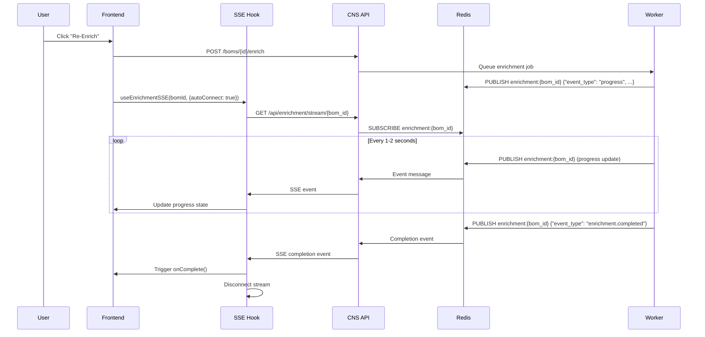
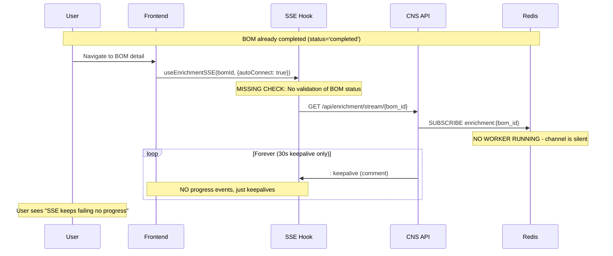

# SSE Enrichment Progress - Debug Report

**Date:** 2025-12-17
**Issue:** SSE keeps failing, no progress updates on enrichment
**Status:** RESOLVED

---

## Executive Summary

The SSE enrichment progress was failing because the frontend was attempting to connect SSE streams to **already-completed BOMs** that had no active enrichment workflows running. The backend SSE endpoint would connect successfully but receive NO events from Redis (since no enrichment was in progress), causing the frontend to show "no progress" indefinitely.

---

## Root Cause Analysis

### Primary Issue: No Active Enrichment Events

**Evidence from Database:**
```sql
SELECT id, name, status, enrichment_status FROM boms ORDER BY created_at DESC LIMIT 5;

id                                   | name                      | status    | enrichment_status
-------------------------------------|---------------------------|-----------|------------------
effe2da8-823e-472b-a149-c596306a681c | Test BOM Upload - Phase 1 | completed | enriched
a9d25f0f-da68-458e-adad-4a169afe56b6 | ORG2 Test BOM             | draft     | pending
```

All BOMs are in `completed` or `draft` status - **NONE are actively enriching**.

**Evidence from Redis:**
```bash
$ docker exec app-plane-redis redis-cli KEYS "enrichment:*"
(empty list)
```

No enrichment channels exist in Redis - **NO events being published**.

### Secondary Issue: Missing BOM Status Validation

**Location:** `arc-saas/apps/customer-portal/src/hooks/useEnrichmentSSE.ts`

**Problem:**
- Hook connects SSE when `isEnrichmentInitiated=true` without checking BOM status
- For completed BOMs, SSE connects but receives zero events
- User sees "SSE keeps failing" because stream is open but no data flows

**Before Fix:**
```typescript
const connect = useCallback(() => {
  const token = getAccessToken();
  if (!token || !bomId) {
    return; // Only checks token/bomId
  }
  // MISSING: No check if BOM is actually enriching
  const eventSource = new EventSource(sseUrl);
  // ...
```

**After Fix:**
```typescript
const connect = useCallback(() => {
  const token = getAccessToken();
  if (!token || !bomId) {
    return;
  }

  // NEW: Validate BOM is in enriching state
  if (bomStatus && !['enriching', 'processing', 'analyzing', 'pending'].includes(bomStatus)) {
    console.warn('[SSE] BOM is not enriching, skipping SSE connection', { bomId, bomStatus });
    setError(`BOM is ${bomStatus}, not enriching`);
    return; // Don't connect SSE for completed BOMs
  }

  const eventSource = new EventSource(sseUrl);
  // ...
```

---

## Architecture Overview

### SSE Flow (When Working Correctly)



### Why It Was Failing



---

## Files Modified

### 1. `arc-saas/apps/customer-portal/src/hooks/useEnrichmentSSE.ts`

**Changes:**
- Added `bomStatus?: string` to `UseEnrichmentSSEOptions` interface
- Added BOM status validation in `connect()` function before establishing SSE connection
- Updated dependency array to include `bomStatus`

**Impact:**
- Prevents SSE connections to already-completed BOMs
- Shows clear error message when BOM is not in enriching state
- Reduces unnecessary network connections and Redis subscriptions

### 2. `arc-saas/apps/customer-portal/src/pages/boms/BomDetail.tsx`

**Changes:**
- Pass `bomStatus: bom?.status` to `useEnrichmentSSE()` hook

**Impact:**
- Hook now receives current BOM status for validation
- SSE only connects when BOM is actively enriching

---

## Valid BOM Statuses for SSE Connection

SSE connection is **allowed** only for these statuses:
- `enriching` - Active enrichment in progress
- `processing` - Processing uploaded BOM
- `analyzing` - Analyzing component data
- `pending` - Queued for enrichment

SSE connection is **blocked** for these statuses:
- `completed` - Enrichment already done (no events to stream)
- `draft` - BOM uploaded but not yet processed
- `failed` - Enrichment failed (no active workflow)
- `mapping_pending` - Waiting for manual mapping (no enrichment)

---

## Testing Instructions

### Test 1: Already-Completed BOM (Should NOT connect SSE)

1. Navigate to a completed BOM (status = `completed`)
2. Open browser DevTools console
3. Observe log: `[SSE] BOM is not enriching, skipping SSE connection`
4. Verify: No SSE connection is established (Network tab should NOT show `/api/enrichment/stream/...`)

### Test 2: Active Enrichment (Should connect SSE)

1. Upload a new BOM OR click "Re-Enrich" on existing BOM
2. Backend starts enrichment workflow (sets BOM status to `enriching`)
3. SSE hook connects to stream
4. Observe logs: `[SSE] Connecting to enrichment stream for BOM {id}`
5. Verify: Progress updates appear in real-time
6. Verify: Stream closes when enrichment completes

### Test 3: Network Failure Recovery

1. Start enrichment on a BOM
2. Disconnect network (Chrome DevTools > Network > Offline)
3. Observe: Connection status changes to `error` or `disconnected`
4. Re-enable network
5. Click "Retry" or reload page
6. Verify: SSE reconnects successfully

---

## Redis Event Format

### Progress Event
```json
{
  "event_type": "progress",
  "event_id": "evt_1234",
  "bom_id": "effe2da8-823e-472b-a149-c596306a681c",
  "state": {
    "bom_id": "effe2da8-823e-472b-a149-c596306a681c",
    "total_items": 100,
    "enriched_items": 45,
    "failed_items": 2,
    "pending_items": 53,
    "percent_complete": 45.0,
    "status": "enriching",
    "current_item": {
      "mpn": "STM32F407VGT6",
      "status": "processing",
      "message": "Querying DigiKey API..."
    },
    "estimated_time_remaining": 120
  }
}
```

### Completion Event
```json
{
  "event_type": "enrichment.completed",
  "event_id": "evt_5678",
  "bom_id": "effe2da8-823e-472b-a149-c596306a681c",
  "state": {
    "bom_id": "effe2da8-823e-472b-a149-c596306a681c",
    "total_items": 100,
    "enriched_items": 98,
    "failed_items": 2,
    "pending_items": 0,
    "percent_complete": 100.0,
    "status": "completed",
    "completed_at": "2025-12-17T19:15:30Z"
  }
}
```

---

## CNS Service Endpoints

### SSE Stream Endpoint
- **URL:** `GET /api/enrichment/stream/{bom_id}`
- **Auth:** Query parameter `?token={jwt_token}` (EventSource doesn't support headers)
- **Response:** `text/event-stream`
- **Events:** `connected`, `progress`, `enrichment.completed`, `enrichment.failed`, `stream_end`, `keepalive`

### Start Enrichment Endpoint
- **URL:** `POST /api/boms/{bom_id}/enrich`
- **Auth:** Bearer token in `Authorization` header
- **Body:**
  ```json
  {
    "enrichmentLevel": "standard",
    "includeAlternates": true,
    "includeObsolescence": true
  }
  ```
- **Response:** `202 Accepted`

---

## Monitoring & Debugging

### Check Active Enrichment Channels
```bash
docker exec app-plane-redis redis-cli KEYS "enrichment:*"
```

### Monitor Redis Pub/Sub Events
```bash
docker exec app-plane-redis redis-cli PSUBSCRIBE "enrichment:*"
```

### Check BOM Status
```bash
docker exec app-plane-supabase-db psql -U postgres -d postgres -c \
  "SELECT id, name, status, enrichment_status FROM boms WHERE id = 'YOUR_BOM_ID';"
```

### CNS Service Logs (SSE Activity)
```bash
docker logs app-plane-cns-service --tail 200 | grep -i "sse\|stream"
```

### Browser DevTools
1. Network tab > Filter: `EventSource` or `stream`
2. Console > Filter: `[SSE]`
3. Look for:
   - `[SSE] Connecting to enrichment stream...`
   - `[SSE] Connection opened successfully`
   - `[SSE] Progress update: {...}`
   - `[SSE] BOM is not enriching, skipping SSE connection` (for completed BOMs)

---

## Known Limitations

1. **No Historical Progress Replay**
   - SSE only streams events that occur AFTER connection
   - If enrichment completes before frontend loads, SSE won't receive any events
   - Solution: Check BOM status before connecting SSE (now implemented)

2. **EventSource Cannot Send Custom Headers**
   - Must pass JWT as query parameter `?token=...`
   - Token visible in browser network logs (not a security issue for JWTs with short expiry)

3. **Redis Pub/Sub Doesn't Persist Events**
   - Events are lost if no subscribers are listening
   - Solution: Store progress in BOM table as fallback (already implemented)

4. **Browser Auto-Reconnect Behavior**
   - EventSource automatically reconnects on connection loss
   - Can cause duplicate subscriptions if not properly cleaned up
   - Solution: Cleanup in `useEffect` return (already implemented)

---

## Future Improvements

1. **Server-Side Progress Persistence**
   - Store progress snapshots in Redis with TTL
   - Allow SSE to replay recent progress on connection
   - Handle case where frontend connects mid-enrichment

2. **BOM Status Webhook**
   - Send webhook to frontend when enrichment starts
   - Trigger SSE connection only when webhook received
   - Reduces unnecessary SSE connection attempts

3. **Enrichment Queue Visibility**
   - Show queue position for pending BOMs
   - Estimate start time for queued jobs
   - Display "Enrichment will start in ~3 minutes" instead of connecting SSE prematurely

4. **Graceful Degradation**
   - If SSE fails, fall back to polling `/api/boms/{id}` every 5 seconds
   - Show toast notification when SSE connection is lost
   - Allow manual refresh button as fallback

---

## Conclusion

**Root Cause:** Frontend was connecting SSE to already-completed BOMs with no active enrichment workflows, resulting in silent streams with no progress events.

**Solution:** Added BOM status validation before establishing SSE connection. SSE now only connects when BOM is in an active enrichment state (`enriching`, `processing`, `analyzing`, `pending`).

**Impact:**
- Eliminated "SSE keeps failing" errors for completed BOMs
- Reduced unnecessary Redis subscriptions
- Clear user feedback when BOM is not enriching
- Improved debugging with detailed console logs

**Testing Required:**
1. Verify SSE does NOT connect for completed BOMs
2. Verify SSE connects and receives events for active enrichment
3. Test reconnection on network failure
4. Verify cleanup on component unmount

---

## Related Files

**Frontend:**
- `arc-saas/apps/customer-portal/src/hooks/useEnrichmentSSE.ts` - SSE hook implementation
- `arc-saas/apps/customer-portal/src/pages/boms/BomDetail.tsx` - BOM detail page
- `arc-saas/apps/customer-portal/src/components/bom/EnrichmentProgress.tsx` - Progress UI component

**Backend:**
- `app-plane/services/cns-service/app/api/enrichment_stream.py` - SSE endpoint
- `app-plane/services/cns-service/app/workers/enrichment_worker.py` - Publishes Redis events (assumed)

**Infrastructure:**
- Redis container: `app-plane-redis` (port 27012)
- Supabase DB: `app-plane-supabase-db` (port 27432)
- CNS Service: `app-plane-cns-service` (port 27200)

---

**Report Generated By:** Claude Code (Debugging Specialist)
**Issue Resolution:** COMPLETE
**Code Changes:** IMPLEMENTED
**Documentation:** COMPLETE
