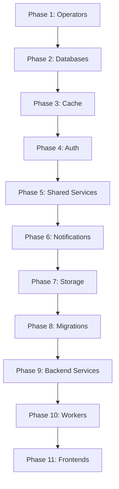

# Ananta Platform SaaS - Complete Terraform/Helm Deployment

## Overview

This document defines the complete end-to-end Terraform/Helm/ArgoCD deployment for the Ananta Platform SaaS - a multi-tenant control plane with 47 microservices.

**Goal**: Single `terraform apply` deploys the entire platform with:
- All 47 microservices
- Vault secrets management
- Database migrations
- Init jobs for bucket creation, namespace setup
- ArgoCD for GitOps visualization
- Health checks and dependencies

---

## Service Inventory (47 Services)

### Phase 1: Core Infrastructure (Namespaces & Operators)

| # | Service | Namespace | Helm Chart | Notes |
|---|---------|-----------|------------|-------|
| 1 | ArgoCD | argocd | argo/argo-cd | GitOps |
| 2 | Vault | vault-system | hashicorp/vault | Secrets management |
| 3 | CloudNativePG Operator | cnpg-system | cloudnative-pg/cloudnative-pg | PostgreSQL operator |

### Phase 2: Control Plane Databases

| # | Service | Namespace | Helm Chart | Notes |
|---|---------|-----------|------------|-------|
| 4 | control-plane-postgres | database-system | bitnami/postgresql | arc_saas, keycloak DBs |
| 5 | control-plane-redis | cache-system | bitnami/redis | Lead tokens, sessions |

### Phase 3: Shared Services

| # | Service | Namespace | Helm Chart | Notes |
|---|---------|-----------|------------|-------|
| 6 | temporal-postgresql | temporal-system | bitnami/postgresql | Temporal DB |
| 7 | temporal | temporal-system | Custom (temporalio/auto-setup) | Workflow engine |
| 8 | temporal-ui | temporal-system | Custom | Workflow dashboard |
| 9 | temporal-init | temporal-system | Job | Creates arc-saas, enrichment namespaces |

### Phase 4: Authentication

| # | Service | Namespace | Helm Chart | Notes |
|---|---------|-----------|------------|-------|
| 10 | keycloak | auth-system | bitnami/keycloak | OAuth2/OIDC |
| 11 | keycloak-init | auth-system | Job | Realm import |

### Phase 5: Novu Notification Stack

| # | Service | Namespace | Helm Chart | Notes |
|---|---------|-----------|------------|-------|
| 12 | novu-mongodb | notifications | bitnami/mongodb | Novu data store |
| 13 | novu-redis | notifications | bitnami/redis | Novu cache |
| 14 | novu-api | notifications | Custom | REST API |
| 15 | novu-ws | notifications | Custom | WebSocket server |
| 16 | novu-worker | notifications | Custom | Background jobs |
| 17 | novu-web | notifications | Custom | Dashboard UI |

### Phase 6: Observability

| # | Service | Namespace | Helm Chart | Notes |
|---|---------|-----------|------------|-------|
| 18 | jaeger | monitoring-system | jaegertracing/jaeger | Distributed tracing |
| 19 | redis-exporter | monitoring-system | prometheus-community/prometheus-redis-exporter | Metrics |

### Phase 7: App Plane Databases

| # | Service | Namespace | Helm Chart | Notes |
|---|---------|-----------|------------|-------|
| 20 | supabase-db | database-system | bitnami/postgresql | Tenant business data |
| 21 | components-v2-postgres | database-system | bitnami/postgresql | Component catalog SSOT |
| 22 | supabase-migrations | database-system | Job | Apply Supabase schema |
| 23 | components-v2-migrations | database-system | Job | Apply Components schema |

### Phase 8: App Plane Infrastructure

| # | Service | Namespace | Helm Chart | Notes |
|---|---------|-----------|------------|-------|
| 24 | app-plane-redis | app-plane | bitnami/redis | App cache |
| 25 | rabbitmq | app-plane | bitnami/rabbitmq | Message broker with Stream |
| 26 | app-plane-minio | app-plane | minio/minio | Object storage |
| 27 | minio-init | app-plane | Job | Create buckets |
| 28 | control-plane-minio | control-plane | minio/minio | Tenant assets |

### Phase 9: Supabase Stack

| # | Service | Namespace | Helm Chart | Notes |
|---|---------|-----------|------------|-------|
| 29 | supabase-api | app-plane | Custom (postgrest) | REST API |
| 30 | supabase-meta | app-plane | Custom | Postgres metadata |
| 31 | supabase-studio | app-plane | Custom | Database admin UI |

### Phase 10: Content Management

| # | Service | Namespace | Helm Chart | Notes |
|---|---------|-----------|------------|-------|
| 32 | directus | app-plane | Custom | Headless CMS |

### Phase 11: Control Plane Backend Services

| # | Service | Namespace | Helm Chart | Notes |
|---|---------|-----------|------------|-------|
| 33 | tenant-management-service | control-plane | Custom | Main API (LoopBack 4) |
| 34 | temporal-worker-service | control-plane | Custom | Provisioning workflows |
| 35 | subscription-service | control-plane | Custom | Billing management |
| 36 | control-plane-migrations | control-plane | Job | Apply arc_saas schema |

### Phase 12: App Plane Backend Services

| # | Service | Namespace | Helm Chart | Notes |
|---|---------|-----------|------------|-------|
| 37 | cns-service | app-plane | Custom | FastAPI - Component Normalization |
| 38 | cns-worker | app-plane | Custom | Temporal worker for enrichment |
| 39 | django-backend | app-plane | Custom | Django REST API |
| 40 | middleware-api | app-plane | Custom | Flask middleware |
| 41 | webhook-bridge | app-plane | Custom | Control-to-App integration |

### Phase 13: Background Workers

| # | Service | Namespace | Helm Chart | Notes |
|---|---------|-----------|------------|-------|
| 42 | audit-logger | app-plane | Custom | RabbitMQ consumer |
| 43 | novu-consumer | app-plane | Custom | Notification consumer |

### Phase 14: Frontend Applications

| # | Service | Namespace | Helm Chart | Notes |
|---|---------|-----------|------------|-------|
| 44 | admin-app | control-plane | Custom | Control Plane Admin (React) |
| 45 | customer-portal | app-plane | Custom | Customer Portal (React) |
| 46 | cns-dashboard | app-plane | Custom | CNS Admin (React) |
| 47 | backstage-portal | app-plane | Custom | Backstage Portal (React) |
| 48 | dashboard | app-plane | Custom | Unified Dashboard (Next.js) |

---

## Namespace Organization

```
Kubernetes Cluster
├── argocd                 # GitOps
├── vault-system           # Secrets management
├── cnpg-system            # PostgreSQL operator
├── database-system        # All PostgreSQL instances
│   ├── control-plane-postgres
│   ├── supabase-db
│   ├── components-v2-postgres
│   └── temporal-postgres
├── cache-system           # All Redis instances
│   ├── control-plane-redis
│   └── app-plane-redis
├── auth-system            # Keycloak
├── temporal-system        # Temporal workflow engine
├── notifications          # Novu stack
├── monitoring-system      # Jaeger, exporters
├── control-plane          # Control plane services
│   ├── tenant-management-service
│   ├── temporal-worker-service
│   ├── subscription-service
│   ├── admin-app
│   └── control-plane-minio
└── app-plane              # App plane services
    ├── supabase-api/meta/studio
    ├── cns-service/worker
    ├── django-backend
    ├── middleware-api
    ├── webhook-bridge
    ├── rabbitmq
    ├── minio
    ├── directus
    ├── audit-logger
    ├── novu-consumer
    ├── customer-portal
    ├── cns-dashboard
    ├── backstage-portal
    └── dashboard
```

---

## Terraform Module Structure

```
infrastructure/terraform/
├── environments/
│   ├── local/
│   │   ├── main.tf           # Local Kind cluster
│   │   ├── variables.tf
│   │   └── terraform.tfvars
│   ├── dev/
│   ├── staging/
│   └── prod/
├── modules/
│   ├── argocd/kubernetes/          # ArgoCD Helm
│   ├── vault/kubernetes/           # Vault Helm + init
│   ├── database/kubernetes/        # CloudNativePG or Bitnami PostgreSQL
│   ├── cache/kubernetes/           # Bitnami Redis
│   ├── temporal/kubernetes/        # Temporal + UI + init
│   ├── keycloak/kubernetes/        # Bitnami Keycloak + realm import
│   ├── novu/kubernetes/            # Complete Novu stack
│   ├── observability/kubernetes/   # Jaeger + exporters
│   ├── supabase/kubernetes/        # PostgREST, Meta, Studio
│   ├── minio/kubernetes/           # MinIO + bucket init
│   ├── rabbitmq/kubernetes/        # Bitnami RabbitMQ with Stream
│   ├── directus/kubernetes/        # Directus CMS
│   ├── control-plane/kubernetes/   # All control plane services
│   ├── app-plane/kubernetes/       # All app plane services
│   └── migrations/kubernetes/      # Database migration jobs
└── DEPLOYMENT_GOALS.md
```

---

## Secrets Management (Vault)

All secrets stored in Vault with Kubernetes auth:

```
secret/
├── database/
│   ├── postgres           # Superuser credentials
│   ├── keycloak           # Keycloak DB user
│   ├── temporal           # Temporal DB user
│   ├── supabase           # Supabase DB credentials
│   └── components-v2      # Components DB credentials
├── cache/
│   ├── control-plane-redis
│   └── app-plane-redis
├── auth/
│   └── keycloak           # Admin credentials, realm secrets
├── storage/
│   ├── control-plane-minio
│   └── app-plane-minio
├── notifications/
│   └── novu               # API keys, JWT secrets
├── control-plane/
│   ├── jwt                # JWT signing key
│   ├── temporal           # Temporal connection
│   └── webhooks           # Webhook secrets
└── app-plane/
    ├── cns-service        # API tokens, AI keys
    ├── directus           # Admin credentials
    └── supabase           # Service role key, JWT
```

---

## Init Jobs & Migrations

### Database Migrations

1. **control-plane-migrations**: Applies arc_saas schema
2. **supabase-migrations**: Applies tenant business data schema
3. **components-v2-migrations**: Applies component catalog schema
4. **temporal-init**: Creates arc-saas and enrichment namespaces

### Bucket Initialization

1. **control-plane-minio-init**: Creates arc-saas-tenants, arc-saas-assets, novu-storage
2. **app-plane-minio-init**: Creates bom-uploads, documents, exports, avatars, enrichment-audit, bulk-uploads

### Realm Import

1. **keycloak-realm-import**: Imports ananta-saas realm with clients

---

## Deployment Order



---

## Health Checks

All services must pass health checks before dependents start:

| Service | Health Endpoint | Check Type |
|---------|-----------------|------------|
| PostgreSQL | pg_isready | TCP |
| Redis | redis-cli ping | TCP |
| Keycloak | /health/ready | HTTP |
| Temporal | tctl cluster health | gRPC |
| Novu API | /v1/health | HTTP |
| CNS Service | /health | HTTP |
| Django | /health | HTTP |
| All frontends | / | HTTP |

---

## Port Mappings

### Control Plane
| Service | Internal | NodePort |
|---------|----------|----------|
| tenant-management-service | 14000 | 31400 |
| admin-app | 80 | 31555 |
| Keycloak | 8080 | 31180 |
| Temporal UI | 8080 | 31021 |

### App Plane
| Service | Internal | NodePort |
|---------|----------|----------|
| cns-service | 8000 | 31200 |
| customer-portal | 80 | 31100 |
| cns-dashboard | 80 | 31250 |
| supabase-studio | 3000 | 31800 |
| supabase-api | 3000 | 31810 |
| directus | 8055 | 31060 |
| rabbitmq-mgmt | 15672 | 31673 |
| minio-console | 9001 | 31041 |

---

## Helm Charts Used

| Component | Chart | Version | Repository |
|-----------|-------|---------|------------|
| ArgoCD | argo-cd | 5.46.x | https://argoproj.github.io/argo-helm |
| Vault | vault | 0.27.x | https://helm.releases.hashicorp.com |
| PostgreSQL | postgresql | 14.x | https://charts.bitnami.com/bitnami |
| Redis | redis | 20.x | https://charts.bitnami.com/bitnami |
| RabbitMQ | rabbitmq | 15.x | https://charts.bitnami.com/bitnami |
| Keycloak | keycloak | 21.x | https://charts.bitnami.com/bitnami |
| MongoDB | mongodb | 15.x | https://charts.bitnami.com/bitnami |
| MinIO | minio | 5.x | https://charts.min.io |
| Jaeger | jaeger | 3.x | https://jaegertracing.github.io/helm-charts |
| CloudNativePG | cloudnative-pg | 0.21.x | https://cloudnative-pg.github.io/charts |

---

## Usage

```bash
# Initialize Terraform
cd infrastructure/terraform/environments/local
terraform init

# Plan deployment
terraform plan -out=tfplan

# Apply - deploys all 47 services
terraform apply tfplan

# Verify deployment
kubectl get pods -A | grep -E "Running|Completed"
```

---

## ArgoCD Integration

All services registered in ArgoCD for visualization:

```yaml
# ApplicationSet for all namespaces
apiVersion: argoproj.io/v1alpha1
kind: ApplicationSet
metadata:
  name: ananta-platform
  namespace: argocd
spec:
  generators:
    - list:
        elements:
          - namespace: control-plane
          - namespace: app-plane
          - namespace: auth-system
          - namespace: temporal-system
          - namespace: notifications
          - namespace: monitoring-system
          - namespace: database-system
          - namespace: cache-system
```
